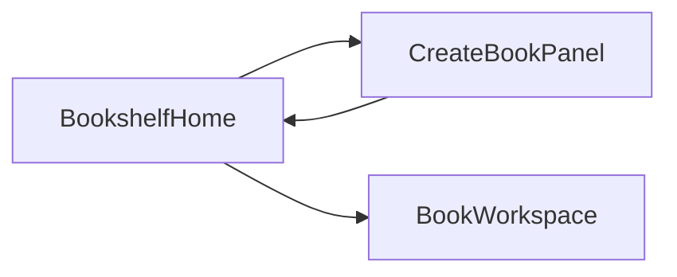

# AI 写书界面设计文档（Write Claw）

## Design Context（占位）

以下三项需在定稿视觉与文案语气前由产品方确认；若尚未填写，建议先在项目根目录执行 **`/teach-impeccable`**（Cursor skill），生成或补全 `.impeccable.md` 后再回填本节。

| 维度 | 占位说明 |
|------|----------|
| **目标受众** | 使用本机桌面应用进行网文/短篇创作的作者；偏单人、离线友好、重文本与结构。 |
| **核心使用场景** | 在书架中创建书本 → 进入书本工作台 → 按阶段完成剧情/大纲/正文，并与 AI 协作修改。 |
| **品牌气质 / 语气** | 待定（避免在未确认前写死具体字体与配色；见本文档「视觉方向」一节）。 |

---

## 1. 目标与范围

### 1.1 产品目标

作者从**书架首页**管理书本，通过**创建书籍**录入元数据与本机**落地文件夹**；点击书本进入**书本开发页**，在「世情短篇」路径下使用**三栏工作台**（左阶段导航、中编辑、右 AI）完成从剧情到审阅的闭环。

### 1.2 范围

- 信息架构、关键页面结构、核心组件与状态。
- 与 Python `pywebview` 桥接层、书本数据模型的**字段与 API 约定**（设计层）。
- **非目标（当前版本）**：除「世情短篇」分支外的完整工作台能力——以**空态 / 待开发**呈现即可。

### 1.3 工作台分流规则（默认，可随产品调整）

| 条件 | 书本开发页表现 |
|------|----------------|
| `book_type === 'short'` 且 `categories` **包含**「世情」 | 启用完整三栏：左侧五阶段导航 + 中间编辑 + 右侧 AI。 |
| 其他组合（如长篇、短篇但未选「世情」等） | 中间主区域展示**统一待开发空态**；左侧五栏与右侧 AI **可不展示或整体灰置/隐藏**，避免误以为功能可用。 |

> **说明**：当前前端短篇分类选项见 `web/src/bridge.ts` 中 `SHORT_GENRE_OPTIONS`（含「世情」「追妻」）。若后续改为「主类型」枚举而非多选分类，需同步修改本节判定逻辑。

---

## 2. 依据的现有实现与差异

| 层级 | 现状（摘要） | 目标文档覆盖的设计增量 |
|------|----------------|-------------------------|
| 壳应用 | `app/main.py`：`js_api` 暴露 `list_books`、`create_book`、`get_book`、`save_book`，加载 `web/dist/index.html`。 | 新增文件夹选择与书本落地路径持久化相关 API（见第 6 节）。 |
| 数据模型 | `app/models.py`：`Book` 含 `id`、`title`、`book_type`、`categories`、`content`、时间戳；无磁盘路径。 | 增加 `output_dir`（或同名）字段；多阶段内容见第 5.4 / 6 节「数据模型演进」。 |
| 书架 | `web/src/pages/Home.tsx`：书名、短篇/长篇、短篇多选分类、列表跳转 `/book/:id`。 | 创建表单增加**落地文件夹**；列表可展示路径摘要。 |
| 编辑页 | `web/src/pages/BookEditor.tsx`：单栏 `textarea`，保存整体 `content`。 | 改为三栏工作台；世情短篇下按阶段切换编辑上下文；非世情分支空态。 |
| 路由 | `web/src/App.tsx`：`/`、`/book/:id`。 | 维持；书本页内部按分流渲染不同布局。 |

---

## 3. 信息架构与路由

- **路由**：保持 `HashRouter` — `/` 书架，`/book/:id` 书本开发页（与现有一致）。
- **用户主路径**：

---

## 4. 页面一：书架首页（作者书架）

### 4.1 布局

- **顶栏**：左侧为产品/页面标题（如「书架」）；右侧主操作 **「创建书籍」**（点击展开或收起创建区域，与当前交互可一致）。
- **主体**：书本列表。延续卡片或行列表风格（可参考 `web/src/pages/Home.css` 演进），保证书名与元信息层级清晰。

### 4.2 书本列表项

每条至少包含：

- **书名**（主文案）。
- **类型**：短篇 / 长篇（与 `book_type` 一致）。
- **短篇时**：分类摘要（如「世情、追妻」），与现有一致。
- **可选增强**：**落地路径**一行——展示截断路径，完整路径通过 `title` 或悬浮提示展示；若未设置，显示弱提示文案如「未指定落地目录」。

### 4.3 创建书籍区域

表单字段如下表（在现有三项基础上扩展）。

---

## 5. 创建书籍：字段与交互

### 5.1 字段清单

| 字段 | 现状 | 设计说明 |
|------|------|----------|
| 书名 | 有 | 必填；提交前 trim；空则后端可回落为「未命名」（与 `BookStore.create_book` 行为一致）。 |
| 类型 | 短篇 / 长篇 | 维持单选。 |
| 短篇分类 | 多选 | 维持；选项来源 `SHORT_GENRE_OPTIONS`。与**工作台分流**联动：含「世情」且为短篇则进入世情三栏工作台（见 1.3）。 |
| **落地文件夹** | 无 | **新增**：用户选择本机目录；界面为只读路径展示 +「选择文件夹」/「更改」。依赖 **Python 桥接**提供系统文件夹对话框（见第 7 节）。 |

### 5.2 落地文件夹交互细节

- 点击「选择文件夹」调用桥接 `pick_folder()`（名称建议，实现可微调），返回选定路径字符串或取消（`null`）。
- 路径在表单内单行展示，过长时中间省略， hover 显示完整路径。
- **校验策略（默认建议）**：落地文件夹为**可选**。未选择时允许创建书本；后续导出/同步策略见 5.3。

### 5.3 待定：未指定落地目录时的行为

可在实现前择一或组合（文档层面列出供评审）：

- **A**：写入应用默认子目录（例如用户文档下的固定文件夹）。
- **B**：仅数据保存在用户数据目录的 `.data/books.json`，不向磁盘写出章节文件，直至用户补设路径。
- **C**：创建时必填路径（与当前「可选」默认相反，需产品确认）。

---

## 6. 页面二：书本开发页（三栏工作台）

### 6.1 整体布局

- 全窗口工作台：顶栏 + 三栏主体，建议在窄窗口（应用默认约 1000×700）下仍可滚动或折叠侧栏，避免挤压编辑区不可读。
- **三栏比例（建议起点）**：
  - 左栏：固定偏窄，例如 `min(280px, 26vw)` 或使用 `clamp(220px, 24vw, 300px)`。
  - 中栏：`1fr`，主编辑区。
  - 右栏：固定偏窄，例如 `clamp(300px, 30vw, 380px)`。
- 大屏可通过 `clamp` 放宽左右栏上限，中栏保持弹性。

### 6.2 顶栏

- **左侧**：返回书架链接（「← 书架」类文案）。
- **中间**：书名 + 副信息（短篇/长篇；短篇时展示分类标签）。
- **右侧**：**保存**及保存状态（保存中 / 已保存 / 失败）；可与现有 `BookEditor` 保存心智对齐。后续可扩展「按阶段自动保存」。

### 6.3 左栏：竖向「表格式」导航（仅世情短篇完整启用）

以下为**固定顺序**的五项，视觉上类似表格左列或列表项，强调一行一项、对齐线清晰：

1. 剧情设计  
2. 剧情细化  
3. 大纲纲要  
4. 正文编写  
5. 编辑审阅  

**交互**：

- 单选高亮当前阶段；切换阶段时中栏加载对应内容上下文。
- **增强（可选）**：方向键上下切换焦点项；`Enter` 确认进入中栏编辑区。

### 6.4 中栏：编辑区

- 随左栏选中项切换**不同的文档上下文**（五个阶段各自一份内容）。
- **与现状关系**：当前模型仅有单一 `content` 字符串；演进方案见下文「数据模型演进」，避免前端与持久化不一致。

### 6.5 右栏：AI 对话

- **组成**：消息列表（用户 / 助手气泡）、多行输入框、发送按钮；可选「停止生成」。
- **上下文绑定**：当前书本标识 + **当前左栏阶段**（便于 AI 针对「大纲」「正文」等不同任务）。
- **错误**：网络失败、服务不可用、未配置密钥等——分层文案（具体服务商无关，由实现期配置）。

### 6.6 非世情短篇 / 其他类型：空态

- **中间主区域**：统一展示「该类型工作台开发中」类说明，可配插图或简洁图形；提供返回书架入口。
- **左侧五栏与右侧 AI**：按产品选择隐藏或整块灰置，避免误操作；与「暂时为空、待之后开发」一致。

---

## 7. 数据模型演进（设计与实现对齐）

### 7.1 落地路径

- 在 `Book` 上新增字段，例如 **`output_dir: string`**，空字符串表示未设置。
- 创建时传入路径则写入；后续允许「书本设置」里修改（若产品需要，可另页设计）。

### 7.2 五阶段内容存储

| 方案 | 说明 |
|------|------|
| **结构化字段** | 在 `Book` 内增加 `stages: Record<StageId, string>` 或五个独立字段；`StageId` 与左栏五项一一对应。持久化仍在 `books.json` 或拆分文件由实现决定。 |
| **分文件** | 每书目录下按阶段命名文件，数据库仅存路径引用；适合与 `output_dir` 深度结合。 |
| **过渡期** | 仅前端内存分栏，仍只调用 `save_book` 写单一 `content`——**不推荐长期使用**，易造成切换阶段丢失或合并歧义。 |

设计评审建议：**优先**在存储层明确阶段字段或文件约定，再实现 UI。

---

## 8. 与后端 / `bridge` 的契约（设计层）

以下为**建议接口名与语义**，实现时可微调命名，但需前后端一致。

### 8.1 现有 API（参考 `app/main.py`）

- `list_books()`
- `create_book(title, book_type, categories)`
- `get_book(book_id)`
- `save_book(book_id, content)`

### 8.2 拟新增 / 扩展

| 接口 | 语义 |
|------|------|
| `pick_folder() -> string \| null` | 打开系统原生文件夹选择对话框；取消返回 `null`。 |
| `create_book(..., output_dir?: string)` | 或在创建后 `set_book_output_dir(book_id, path)`；将路径写入书本模型。 |
| `get_book` / `list_books` 返回体 | 包含 `output_dir`（若已有字段）。 |
| 后续（阶段持久化） | `get_stage(book_id, stage_id)` / `save_stage(book_id, stage_id, text)`，或扩展 `save_book` 为结构化 payload。 |

前端 `web/src/bridge.ts` 需在 `Window.pywebview.api` 类型声明中同步上述方法；浏览器无 pywebview 时的 mock 可返回固定路径或略过。

---

## 9. 空态、加载、错误

| 场景 | 处理要点 |
|------|----------|
| 书架无书 | 延续现有「暂无书籍」提示 + 引导创建。 |
| 创建失败 | 表单区域错误文案；保留用户已填字段。 |
| 书本未找到 | 与现有一致：错误信息 + 返回书架。 |
| 世情工作台加载 | 左栏与中栏可骨架屏或轻量「加载中」。 |
| AI 不可用 | 右栏展示说明与重试，不阻塞中栏纯人文编辑。 |

---

## 10. 可访问性与桌面端特性

- **焦点顺序**：建议从左栏导航 → 中栏编辑区 → 右栏输入（Tab 顺序可测）。
- **键盘**：左栏列表项可通过键盘操作（见 6.3）；中栏为常规文本域快捷键。
- **减少动效**：尊重 `prefers-reduced-motion`；页面切换以 opacity / 轻 transform 为主，避免对 layout 属性做高频动画（与 frontend-design 技能一致）。
- **Escape**：若未来右栏为抽屉式，可约定 `Escape` 关闭；当前固定三栏可无强制行为。

---

## 11. 视觉方向（待 `.impeccable.md` 锁定）

- 本文档只约束**信息架构、布局分区、组件职责与交互状态**。
- 具体字体、色板、圆角与装饰在确认 **Design Context** 与 **`.impeccable.md`** 后统一；避免默认「深色 + 霓虹强调 + 泛滥渐变」等泛 AI 审美。
- 若需一次性建立项目设计上下文，可在 Cursor 中执行 **`/teach-impeccable`**，再将结论摘要追加到本文档「Design Context」表格。

---

## 12. 文档修订记录

| 日期 | 说明 |
|------|------|
| 2026-05-06 | 初版：对齐 Write Claw 现有书架与单栏编辑器，补充落地文件夹、三栏工作台与世情分流规则。 |
