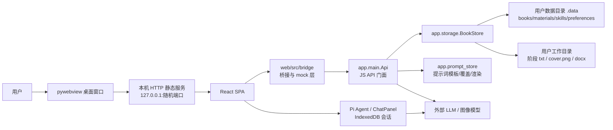

# 项目整体设计

> 本文基于当前源码梳理 DeepSeekWrite 的整体架构、目录职责、核心类和主要前端组件。若与旧版说明有差异，以当前源码为准。

## 1. 项目定位

DeepSeekWrite 是一款本地桌面写作应用，面向短篇小说、剧本和未来长篇创作。项目采用 Python 桌面壳 + React 静态前端 + 本地 JSON 存储 + Pi 智能体框架的混合架构。

核心设计目标：

1. 用户数据完全本地化：书籍、素材、技能、偏好和提示词覆盖都保存在本机用户数据目录。
2. 桌面端优先：运行时由 `pywebview` 打开本地窗口，Python 通过 `js_api` 暴露原生能力。
3. 前端可独立调试：浏览器开发模式没有 `pywebview` 时，桥接层自动回退到 `localStorage` mock。
4. 工作台能力可扩展：短篇和剧本用独立 workspace 代码路径，当前能力接近，但后续可分化。
5. AI 能力按阶段隔离：每个阶段有独立提示词、读取范围、工具集和 Pi 会话。

## 2. 总体架构



运行链路：

1. `python -m app.main` 启动。
2. `app.main` 检查 `web/dist/index.html`，启动本机回环 HTTP 服务提供静态前端。
3. `pywebview.create_window()` 打开桌面窗口，并把 `Api` 实例注入到 `window.pywebview.api`。
4. React 挂载后通过 `web/src/bridge/runtime.ts` 等待或获取 `pywebview.api`。
5. 桌面端数据调用进入 `Api`，再进入 `BookStore` 和 `prompt_store`；浏览器端则走 `mockStore` 和 `localStorage`。
6. AI 聊天面板由 Pi Web UI 承载，系统提示词来自后端或本地嵌入模板，工具调用写回 React 编辑器状态。

## 3. 顶层目录职责

| 路径 | 职责 |
| --- | --- |
| `app/` | Python 后端、桌面壳、JS API、本地存储、提示词、模型配置、图像生成。 |
| `web/` | React + TypeScript + Vite 前端，包含页面、桥接层、Pi 集成、工作台和状态管理。 |
| `packaging/` | PyInstaller 打包入口与 spec，负责把前端构建产物、提示词、资源文件打入桌面包。 |
| `docs/` | 产品、智能体和架构设计文档。本文也放在这里。 |
| `requirements.txt` | Python 运行依赖，包含 `pywebview`、平台相关 GUI 依赖、`python-docx`。 |
| `README.md` | 面向使用者和开发者的快速开始说明。 |
| `AGENTS.md` / `CLAUDE.md` | 面向 AI 编码代理的项目约定。`AGENTS.md` 较新，`CLAUDE.md` 中部分描述已落后于当前源码。 |
| `run.sh` / `linux-rub.sh` | 本地启动辅助脚本。 |

## 4. 后端设计

### 4.1 `app/main.py`

`main.py` 是桌面运行入口，包含三类职责：

1. 环境准备：配置 Linux Qt 输入法、macOS Cocoa 后端、Windows WebView2 运行时。
2. 本地 HTTP 服务：`DistHTTPRequestHandler` 修正 MIME、禁用缓存，并提供 `/llm-proxy/...` 代理。
3. JS API：`Api` 类把 Python 能力暴露给前端。

核心类：

| 类 | 作用 |
| --- | --- |
| `DistHTTPRequestHandler` | 继承 `SimpleHTTPRequestHandler`，服务 `web/dist`；修正 `.js/.css/.json/.svg/.wasm` MIME；为 LLM 代理加 CORS；对 Vite chunk 禁用缓存。 |
| `Api` | 前端唯一的 Python API 门面。内部持有 `BookStore`，对外提供书籍、素材、技能、偏好、提示词、封面、导入导出、docx 导出等方法。 |

`Api` 主要方法分组：

| 分组 | 方法 |
| --- | --- |
| 书籍 | `list_books`、`create_book`、`get_book`、`save_book`、`delete_book`、`pick_folder` |
| 素材库 | `list_materials`、`get_material`、`create_material`、`save_material`、`delete_material`、`get_material_genres` |
| 技能库 | `list_skills`、`get_skill`、`create_skill`、`save_skill`、`delete_skill` |
| 偏好 | `get_workspace_root`、`set_workspace_root`、`get_appearance_style`、`set_appearance_style` |
| AI 配置 | `get_ai_model_config`、`save_ai_model_config`、`get_ai_defaults` |
| 创作空间提示词 | `get_workspace_system_prompt`、`read_workspace_agent_prompt_template`、`save_workspace_agent_prompt_override`、`reset_workspace_agent_prompt_override` |
| 读取范围 | `get_workspace_agent_read_access`、`set_workspace_agent_read_access`、`sync_workspace_agent_read_access_defaults`、`get_default_workspace_agent_read_access` |
| 素材/技能提示词 | `get_material_system_prompt`、`read_material_agent_prompt_template`、`save_material_agent_prompt_override`、`get_skill_system_prompt` 等 |
| 封面与导出 | `get_book_cover`、`get_book_covers`、`generate_book_cover`、`export_library`、`import_library`、`export_docx` |

### 4.2 `app/models.py`

`models.py` 是业务数据契约中心。它定义类型、阶段键、迁移逻辑和三个核心数据类。

核心数据类：

| 类 | 作用 |
| --- | --- |
| `Book` | 书籍实体。保存标题、类型、分类、正文、输出目录、关联素材/技能、状态、阶段内容和专家正文结构。 |
| `Material` | 素材实体。保存素材类型、一级分类、遗留子分类、6 个素材阶段和输出目录。 |
| `Skill` | 技能集合实体。每个技能按阶段保存多条技能条目。 |

关键阶段设计：

| 类型 | 当前源码中的阶段 |
| --- | --- |
| 短篇可见阶段 | `character_design` 人物设计、`plot_design` 剧情、`outline` 大纲、`draft` 正文编写 |
| 短篇内容槽位 | `character_design`、`plot_design`、`intro_design`、`plot_refine`、`outline`、`draft` |
| 短篇遗留兼容 | `draft_review`、`format_conversion`、`qinggan_*` 旧键 |
| 剧本可见阶段 | `character_design` 人物设计、`plot_design` 剧情、`outline` 大纲、`draft` 正文编写 |
| 剧本内容槽位 | `character_design`、`plot_design`、`plot_refine`、`outline`、`draft` |
| 剧本遗留兼容 | `intro_design`、`draft_review`、`format_conversion`、`qinggan_*` 旧键 |
| 素材阶段 | `character`、`intro`、`gimmick`、`plot_refine`、`pacing`、`draft_excerpt` |
| 技能阶段 | `character_design`、`plot_design`、`outline`、`draft`、`expert_section_writer` |

注意：当前源码中剧本工作台不展示 `intro_design`，`script/stages.ts` 与 `models.py` 都不把它作为运行内容槽位；它主要作为历史数据兼容键存在。

重要函数：

| 函数 | 作用 |
| --- | --- |
| `default_stages` | 根据书籍类型创建默认阶段字典。 |
| `normalize_stages_from_storage` | 从 JSON 读取阶段，补齐缺失字段并执行旧键迁移。 |
| `apply_stage_patch` | 保存时合并前端传入的局部阶段 patch，保留未提交字段。 |
| `default_expert_draft` | 根据短篇/剧本生成专家正文默认结构。短篇从“导语 + 第一节”开始，剧本从“第一节”开始。 |
| `normalize_expert_draft_from_storage` | 读取专家正文结构时补齐章节、人物状态、活动章节。 |
| `normalize_skill_stages_from_storage` | 兼容技能旧格式，把旧导语/剧情细化并入剧情技能，把旧审阅/格式转换/总控并入正文专家编写技能。 |

### 4.3 `app/storage.py`

`storage.py` 是本地持久化层。

核心类：

| 类 | 作用 |
| --- | --- |
| `BookStore` | 管理书籍、素材、技能三类数据的内存缓存、文件重载、原子保存、输出目录写入和级联解绑。 |

设计要点：

1. 所有 JSON 写入走临时文件 + `os.replace`，避免半写入。
2. `_data_file_lock()` 对 `.data` 下的读改写加跨进程锁，减少多窗口覆盖。
3. `_file_signature()` 记录文件时间戳和大小，外部变化时自动重载缓存。
4. 书籍保存时会把阶段内容导出到 `output_dir/{stage_id}.txt`。
5. 素材和技能保存时也会写入各自输出目录。
6. 删除素材/技能会清理输出目录，并把已关联的书籍字段置空。
7. 首次无技能数据时，会读取 `app/prompt_defaults/skill/default_skill_template.json` 播种默认技能。

偏好和配置也放在此文件中：

| 数据 | 存储位置 | 相关函数 |
| --- | --- | --- |
| 工作目录 | `.data/preferences.json` | `read_saved_workspace_root`、`write_saved_workspace_root` |
| 界面风格 | `.data/preferences.json` | `read_appearance_style`、`write_appearance_style` |
| 智能体读取范围 | `.data/preferences.json` | `read_workspace_agent_read_access_for_type`、`write_workspace_agent_read_access_for_type` |
| 模型配置 | `.data/preferences.json` | `read_ai_model_config`、`write_ai_model_config` |
| 图像模型配置 | `.data/preferences.json` | `read_image_model_config` |

### 4.4 `app/prompt_store.py`

`prompt_store.py` 管理提示词模板的读取、覆盖、迁移和占位符渲染。

提示词读取优先级：

1. 用户覆盖：`.data/prompt_overrides/...`
2. 内置默认：`app/prompt_defaults/...`
3. 缺失时返回带路径的错误提示文本。

三条提示词管线：

| 管线 | 说明 |
| --- | --- |
| 创作空间 | `short/shared` 和 `script/shared`，按 workspace type 隔离。 |
| 素材库 | `material/{short,long,script}/shared`，兼容旧素材阶段模板。 |
| 技能库 | `skill/{short,long,script}/shared`，提供技能库管理智能体提示词。 |

迁移逻辑：

1. 旧 `short/qinggan` 覆盖会迁移到 `short/shared`。
2. 旧剧情设计、导语设计、剧情细化覆盖会合并为新的剧情智能体提示词。
3. 剧本提示词与短篇提示词隔离；缺少用户覆盖时直接读取 `script/shared` 内置默认模板。

主要渲染函数：

| 函数 | 作用 |
| --- | --- |
| `render_workspace_system_prompt` | 渲染书籍工作台阶段/智能体系统提示词。 |
| `render_material_system_prompt` | 渲染素材库智能体提示词。 |
| `render_skill_system_prompt` | 渲染技能库智能体提示词。 |
| `read_raw_*_for_editor` | 给设置页读取原始模板文本，不做上下文渲染。 |

### 4.5 `app/runtime_paths.py`

负责区分源码运行和 PyInstaller 冻结运行的路径。

| 函数 | 作用 |
| --- | --- |
| `is_frozen` | 判断是否为 PyInstaller 冻结环境。 |
| `bundle_root` | 只读资源根。源码时为项目根；冻结时为 `_MEIPASS`。 |
| `writable_root` | 可写根。源码时为项目根；冻结时为可执行文件所在目录。 |
| `app_data_root` | 当前用户的应用数据目录，如 macOS 的 `~/Library/Application Support/DeepSeekWrite`。 |
| `legacy_data_root` | 旧版 `.data` 位置。 |
| `data_root` | 当前 `.data` 目录，并执行旧数据迁移。 |

### 4.6 `app/ai_env.py`

负责从 `.env`、`.deepseek.env`、`.kimi.env` 导入旧式或预置模型配置。

设计特点：

1. 冻结版优先读取可执行文件旁边的配置，避免把用户密钥打进包内。
2. 支持 `models_type=owner` 的多模型配置。
3. 支持旧字段 `model_name_main`、`model_name`、`model_api_key`、`model_source`。
4. 文字模型未配置时，返回内置 DeepSeek Pro / Flash 占位模型。
5. 图像模型可从 env 读取，也有内置默认配置；文档和代码提交时不要暴露或传播真实密钥。

### 4.7 `app/image_generate.py`

独立图像生成 helper：调用 OpenAI 风格的 `/images/generations` 接口，解析 base64、URL、inline data 等多种返回格式，并保存图片。

当前 `app/main.py` 内也保留了一份封面生成相关实现，`Api.generate_book_cover()` 使用主入口内的 `generate_image()` 保存为 `cover.png`。

### 4.8 `app/prompt_defaults/`

内置提示词资源目录，也是打包时必须包含的只读资源。

| 子目录 | 作用 |
| --- | --- |
| `short/shared/` | 短篇创作空间提示词和读取范围默认 JSON。 |
| `script/shared/` | 剧本创作空间提示词和读取范围默认 JSON。当前仍有一些历史模板文件，运行时以 `prompt_store.py` 的 agent/stage 定义为准。 |
| `material/` | 素材库提示词，包含 long/short/script/shared 等路径和旧分类路径。 |
| `skill/` | 技能库提示词和默认技能模板。 |

## 5. 前端设计

### 5.1 前端入口

| 文件 | 作用 |
| --- | --- |
| `web/src/main.tsx` | React 入口。注册 Pi 工具渲染器，安装全局错误处理，立即挂载 App；桥接等待交给 `getBridgeApi()`。 |
| `web/src/App.tsx` | `HashRouter` 路由入口，包含首页、创作空间设置、素材/技能设置、书籍/素材/技能编辑页。 |
| `web/src/process-polyfill.ts` | 为浏览器环境补齐依赖包需要的 process 能力。 |
| `web/src/AppearanceProvider.tsx` / `appearance.ts` | 管理古风/现代界面风格，读写本地偏好。 |

路由：

| 路径 | 页面 |
| --- | --- |
| `/` | `Home` |
| `/workspace-settings` | `WorkspaceSettings` |
| `/material-settings` | `MaterialSettings` |
| `/skill-settings` | `SkillSettings` |
| `/book/:id` | `BookEditor` |
| `/material/:id` | `MaterialEditor` |
| `/skill/:id` | `SkillEditor` |

### 5.2 `web/src/bridge/`

桥接层是前后端边界。它向页面暴露稳定的 TypeScript API，内部判断使用桌面 API 还是浏览器 mock。

| 文件 | 作用 |
| --- | --- |
| `runtime.ts` | `getBridgeApi()` 单例等待 `window.pywebview.api`，避免并发调用抢先走 mock。 |
| `bridgeApiTypes.ts` | 声明 `window.pywebview.api` 的 TypeScript 方法签名。 |
| `legacy.ts` / `native.ts` | 对外兼容导出，聚合新拆分的 client。 |
| `apiTypes.ts` | 保存书籍、素材、技能时的 option 类型。 |
| `booksClient.ts` | 书籍 CRUD 和文件夹选择，桌面端调用 Python，浏览器端调用 mock。 |
| `materialsClient.ts` | 素材库 CRUD。 |
| `skillsClient.ts` | 技能库 CRUD。 |
| `preferencesClient.ts` | 工作目录、界面风格、读取范围偏好，含 localStorage 与桌面端同步策略。 |
| `workspacePromptClient.ts` | 创作空间提示词读取、保存、重置和本地 fallback 渲染。 |
| `materialPromptClient.ts` | 素材库提示词读取、保存、重置和渲染。 |
| `skillPromptClient.ts` | 技能库提示词读取、保存、重置和渲染。 |
| `aiModelConfig.ts` | 模型配置类型、归一化、占位 API Key 处理。 |
| `coverClient.ts` | 书籍封面读取、批量读取、生成和 docx 导出。 |
| `libraryClient.ts` | 素材/技能 zip 导入导出。 |
| `libraryDomain.ts` | 素材、技能类型、阶段键、标签、归一化函数。 |
| `mockStore.ts` | 浏览器开发模式 mock 数据，保存到 localStorage，并播种默认技能。 |
| `promptLocalStorage.ts` | 浏览器模式下提示词覆盖的 localStorage 键和迁移逻辑。 |

`web/src/bridge.ts` 现在只是聚合入口：

```ts
export * from './bridge/runtime'
export * from './bridge/legacy'
export * from './workspaces/registry'
```

### 5.3 `web/src/domain/`

| 文件 | 作用 |
| --- | --- |
| `workspaceCore.ts` | 前端业务模型中心。定义 `Book`、`ExpertDraft`、阶段归一化、短篇/剧本类型判断、专家正文默认值。 |
| `workspace.ts` | 对 `workspaceCore` 和库领域类型的再导出，方便页面使用。 |

这个目录的职责和后端 `models.py` 对应。后续新增书籍类型或阶段时，应同时维护这两边。

### 5.4 `web/src/pages/`

#### `Home.tsx`

首页和资源管理入口。

职责：

1. 加载书籍、素材、技能、封面、工作目录和模型配置。
2. 创建/删除书籍、素材、技能。
3. 配置工作目录、界面风格和 AI 模型。
4. 导入/导出素材包、技能包。
5. 通过 `CardGrid` 展示三类资源。

#### `BookEditor.tsx`

书籍工作台总控页面。它负责组装状态、左侧树、中间编辑区、右侧 AI 面板和保存逻辑。

设计重点：

1. 多书会话：同类型未完成书籍可在左侧树里切换，已加载书籍的运行状态保存在 `workspaceStore`。
2. 阶段树：左侧可见阶段和真实内容槽位不是一一对应，剧情父阶段会展开子槽位，正文阶段会展开专家正文小节。
3. 正文专家模式：`draft` 阶段使用短篇或剧本专属的 `ExpertDraftEditor` 和 `ExpertDraftAiChat`。
4. 流式写入：AI token 先进入按书籍/阶段隔离的 buffer，再用 `requestAnimationFrame` 刷入编辑器。
5. 保存快照：`persistedSnapshot` 用于判断未保存变更，保存时合并阶段 patch 并同步 `content`。

`pages/bookEditor/` 子目录职责：

| 文件 | 作用 |
| --- | --- |
| `workspaceTypes.ts` | 工作台常量和类型，如空阶段、保存选项、离开确认文案。 |
| `workspaceSession.ts` | 创建会话、快照、未保存判断、工作台书籍排序合并。 |
| `stageEditing.ts` | 阶段选择、剧情子槽位、字数统计、读取范围解析等编辑辅助逻辑。 |
| `expertDraftUtils.ts` | 专家正文小节在树上的标签等辅助。 |
| `useWorkspacePersistence.ts` | 加载书籍、素材、技能、封面和读取范围；保存当前书籍；刷新列表。 |
| `useWorkspaceStreaming.ts` | AI 流式写入编辑器，处理 replace/append/append_token/streaming_end。 |
| `useWorkspaceStageRuntime.ts` | 普通阶段编辑、切换和当前阶段内容读取。 |
| `useExpertDraftRuntime.ts` | 专家正文结构更新、分节写作启动/停止、合并和导出。 |
| `useWorkspaceTreeNavigation.ts` | 左侧树选择书籍、阶段、剧情子方向和正文小节。 |
| `useWorkspaceViewModel.ts` | 将当前 book/session/stage 派生为页面渲染模型。 |
| `useWorkspaceTitleEditing.ts` | 左侧书名编辑。 |
| `useWorkspaceKeyboardShortcuts.ts` | 键盘快捷键，如保存。 |
| `useWorkspaceChatEpochs.ts` | 新建对话时递增 epoch，重建 Pi 会话。 |
| `useAiPanelWidth.ts` / `aiPanelLayout.ts` | AI 侧栏宽度计算、拖拽和持久化。 |
| `useBookCoverRuntime.ts` | 封面生成、查看、清除。 |
| `useWorkspaceExportActions.ts` | 正文导出相关动作。 |
| `useLibrarySelectors.ts` | 关联素材/技能选择弹窗状态。 |
| `WorkspaceRailPanel.tsx` | 左侧树面板包装。 |
| `WorkspaceEditorPane.tsx` | 中间编辑区，按普通阶段/剧情父阶段/专家正文切换渲染。 |
| `WorkspaceAiPanel.tsx` | 右侧 AI 面板，按阶段和专家模式渲染对应 Pi 聊天层。 |
| `WorkspaceBookHeader.tsx` | 工作台顶部书籍信息和操作。 |
| `WorkspaceSplitter.tsx` | 中间编辑区与 AI 面板的拖拽分隔条。 |
| `LibrarySelectorDialogs.tsx` | 素材库和技能库选择弹窗。 |
| `WorkspaceCoverDialogs.tsx` / `CoverDialogs.tsx` | 封面生成和预览弹窗。 |

#### `MaterialEditor.tsx`

素材编辑器。结构和书籍工作台相似，但阶段固定为 6 个素材阶段，AI 面板以素材库管理智能体运行。

特点：

1. 左侧 `WorkspaceTreeNav` 展示素材阶段。
2. 中间单文本编辑区保存当前素材阶段。
3. 右侧 `WorkspaceAiChat` 使用 `workspaceType="material"`，工具为读取/写入素材阶段。
4. 流式 token 使用素材阶段 buffer 隔离。

#### `SkillEditor.tsx`

技能编辑器。每个阶段下可以有多条技能条目。

特点：

1. 左侧树展示技能阶段和条目。
2. 中间编辑选中技能条目的标题和正文。
3. 右侧 AI 使用 `workspaceType="skill"`，工具为读取/写入技能内容。
4. 技能保存格式为 `Record<SkillStageId, SkillStageEntry[]>`。

#### 设置页

| 页面 | 作用 |
| --- | --- |
| `WorkspaceSettings.tsx` | 管理短篇/剧本创作空间的智能体提示词和读取范围，500ms 自动保存。 |
| `MaterialSettings.tsx` | 管理短篇/长篇/剧本素材库管理智能体提示词。 |
| `SkillSettings.tsx` | 管理短篇/长篇/剧本技能库管理智能体提示词。 |

### 5.5 `web/src/components/`

| 文件 | 作用 |
| --- | --- |
| `WorkspaceAiChat.tsx` | Pi Web UI 集成层。负责创建 Agent、装配系统提示词、模型选择、附件处理、工具集、流式模型函数和发送校验。 |
| `WorkspaceTreeNav.tsx` | 通用树形导航组件。支持书籍树、阶段树、子节点、创建子节点、标题编辑。 |
| `CardGrid.tsx` | 首页卡片列表和书籍/素材/技能到卡片数据的转换。 |
| `MaterialGenreSelector.tsx` | 素材类型、一级分类、筛选器组件。 |
| `AppErrorBoundary.tsx` | React 错误边界。 |
| `DraftStageEditor.tsx` | 正文阶段编辑组件，当前主要工作台已拆到 `WorkspaceEditorPane` 和专家正文组件。 |

### 5.6 `web/src/pi/`

Pi 集成层负责让工作台 AI 在浏览器里稳定运行。

| 文件 | 作用 |
| --- | --- |
| `setupPiWorkspace.ts` | 初始化 Pi IndexedDB 存储，并加初始化锁和重试。 |
| `piStorageLock.ts` | IndexedDB 相关操作锁和瞬态错误重试。 |
| `resolveWorkspaceChatModel.ts` | 从应用模型配置、Pi ProviderKeysStore 或自定义 provider 中解析当前聊天模型。 |
| `workspaceChatPreferences.ts` | 记录当前工作台偏好的模型和 thinking level，并绑定到 Agent 状态。 |
| `workspaceStreamFn.ts` | 为本地 HTTP shell 下的特殊 provider 应用 CORS 代理。 |
| `workspaceStageAgents.ts` | 根据 `workspaceType` 和 `bookType` 分发到短篇、剧本、素材、技能各自工具集。 |
| `sessionId.ts` | 生成稳定的 Pi 会话 ID，隔离书籍、阶段、小节和新对话 epoch。 |
| `skillMessageTransform.ts` | 把 `load_skill` 工具结果转换为 user 消息，便于技能内容进入模型上下文。 |
| `deepSeekWriteToolRenderers.ts` | 自定义 Pi 工具调用渲染器，让工具状态在聊天 UI 中更清晰。 |
| `writingAssistantPrompt.ts` | 通用写作助手提示词片段。 |

唯一显式 class：

| 类 | 作用 |
| --- | --- |
| `WorkspaceSendValidationError` | `WorkspaceAiChat.tsx` 内部错误类型，用于拦截附件数量/类型等发送校验失败。 |
| `DeepSeekWriteToolRenderer` | Pi 工具渲染器类，负责把 DeepSeekWrite 工具调用渲染成定制 UI。 |

### 5.7 `web/src/workspaces/`

该目录承载不同工作空间的阶段定义、读取范围、工具集和专家正文能力。

| 路径 | 作用 |
| --- | --- |
| `registry.ts` | 工作空间注册表。短篇、剧本启用；长篇已注册但 `enabled=false`。 |
| `short/` | 短篇工作空间定义。 |
| `script/` | 剧本工作空间定义。 |
| `material/` | 素材库智能体工具，按 long/short/script 保持独立代码路径。 |
| `skill/` | 技能库智能体工具，按 long/short/script 保持独立代码路径。 |
| `shared/` | Pi 工具封装、读取范围类型、文本替换匹配等共享能力。 |

短篇工作空间：

| 文件 | 作用 |
| --- | --- |
| `short/stages.ts` | 短篇可见阶段、剧情子阶段、内容槽位、旧键迁移。 |
| `short/stageReadAccess.ts` | 短篇智能体 ID、默认读取范围、读取范围归一化。 |
| `short/stageAgents.ts` | 短篇创作空间工具集。 |
| `short/loadSkill.ts` | 解析技能 front matter，把绑定技能追加到系统提示词，提供 `load_skill` 工具。 |
| `short/expertDraft/*` | 短篇专家正文 UI、总控工具、分节写手工具和提示词。 |

剧本工作空间：

| 文件 | 作用 |
| --- | --- |
| `script/stages.ts` | 剧本可见阶段、剧情子阶段、内容槽位、旧键迁移。当前剧情子阶段为剧情设计和剧情细化。 |
| `script/stageReadAccess.ts` | 剧本智能体 ID、默认读取范围、读取范围归一化。 |
| `script/stageAgents.ts` | 剧本创作空间工具集。结构与短篇隔离，便于后续扩展剧本专属工具。 |
| `script/loadSkill.ts` | 剧本技能加载逻辑。 |
| `script/expertDraft/*` | 剧本专家正文 UI、总控工具、分节写手工具和提示词。 |

创作空间工具：

| 工具名 | 作用 |
| --- | --- |
| `read_workspace_content` | 读取允许范围内的工作台阶段内容。 |
| `search_workspace_text` | 在允许阶段内搜索文本片段，返回位置和上下文。 |
| `read_linked_material_content` | 读取绑定素材库的允许阶段内容。 |
| `copy_stage_to_format_conversion` | 历史兼容工具，把阶段内容复制到格式转换类目标。 |
| `global_text_replace` | 全局文本替换。 |
| `replace_current_stage_text` | 在当前阶段内做更精确的片段替换。 |
| `write_workspace_editor` | 写入当前编辑器，支持替换、追加和流式 token。 |
| `load_skill` | 读取绑定技能中的可加载技能内容。 |

素材/技能库工具：

| 工具名 | 作用 |
| --- | --- |
| `read_material_content` | 读取素材当前阶段或其它阶段内容。 |
| `write_material_editor` | 写入素材编辑器。 |
| `read_skill_content` | 读取技能当前阶段内容。 |
| `write_skill_editor` | 写入技能编辑器。 |

### 5.8 `web/src/stores/`

项目使用 Zustand 保存跨组件运行态。

| 文件 | 作用 |
| --- | --- |
| `homeStore.ts` | 首页书籍、素材、技能、封面、工作目录和模型配置缓存。 |
| `workspaceStore.ts` | 书籍工作台多书会话运行态，包括 activeBookId、sessions、loadedBookIds。 |

### 5.9 其它前端目录

| 路径 | 作用 |
| --- | --- |
| `web/src/prompt/` | 浏览器 fallback 提示词渲染和内置模板 glob。 |
| `web/src/prompts/` | 通用写作提示词和工具模板文本。 |
| `web/src/styles/` | 全局主题样式。 |
| `web/src/assets/` | Vite 示例/静态资源，运行主图标主要来自 `app/assets` 和 `web/public`。 |
| `web/src/vendor/` | 浏览器兼容版 `LMStudioClient`，通过 Vite alias 替换 `@lmstudio/sdk`。 |
| `web/public/` | favicon 和图标资源。 |

### 5.10 前端显式 class 索引

大多数前端代码使用函数组件和 Hooks，真正的 `class` 很少：

| 类 | 文件 | 作用 |
| --- | --- | --- |
| `AppErrorBoundary` | `web/src/components/AppErrorBoundary.tsx` | React 错误边界，捕获页面渲染错误并展示兜底状态。 |
| `WorkspaceSendValidationError` | `web/src/components/WorkspaceAiChat.tsx` | AI 发送前的校验错误类型，用于区分用户可修正的发送问题。 |
| `DeepSeekWriteToolRenderer` | `web/src/pi/deepSeekWriteToolRenderers.ts` | Pi 工具调用定制渲染器，让读写阶段、加载技能、替换文本等工具在聊天面板中有更清晰的展示。 |
| `LMStudioClient` | `web/src/vendor/lmstudio-sdk-browser.ts` | 浏览器兼容的 LM Studio SDK 替身，配合 Vite alias 使用。 |

## 6. 数据与保存设计

### 6.1 用户数据位置

`runtime_paths.data_root()` 返回真正的数据目录：

| 平台 | 位置 |
| --- | --- |
| Windows | `%APPDATA%/DeepSeekWrite/.data` |
| macOS | `~/Library/Application Support/DeepSeekWrite/.data` |
| Linux | `${XDG_DATA_HOME:-~/.local/share}/DeepSeekWrite/.data` |

旧版本项目根或可执行文件旁的 `.data` 会在首次使用时复制缺失项到新位置。

### 6.2 JSON 文件

| 文件 | 内容 |
| --- | --- |
| `books.json` | 书籍、阶段内容、专家正文结构、关联素材/技能。 |
| `materials.json` | 素材库数据。 |
| `skills.json` | 技能集合和阶段技能条目。 |
| `preferences.json` | 工作目录、界面风格、模型配置、智能体读取范围。 |
| `prompt_overrides/` | 用户覆盖的提示词。 |

### 6.3 工作目录导出

当用户设置工作目录后：

1. 创建书籍会在工作目录下创建同名书籍文件夹。
2. 每次保存书籍，阶段内容写为 `{stage_id}.txt`。
3. 创建素材会进入 `素材库/{素材名}`。
4. 创建技能会进入 `技能库/{技能名}`。
5. 生成封面保存为书籍目录下 `cover.png`。
6. docx 导出由用户选择目标文件夹，不一定在书籍工作目录内。

### 6.4 保存与兼容原则

1. 前端保存阶段时传局部 patch，后端 `apply_stage_patch()` 合并并保留未传字段。
2. 后端保存阶段后同步顶层 `Book.content = stages["draft"]`。
3. 读取旧数据时，两端都会做阶段键归一化。
4. 技能旧字段或误拆单阶段数据会被恢复为阶段下的一条技能。
5. 删除素材/技能不删除书籍，只清空书籍上的关联 ID。

## 7. AI 与智能体设计

### 7.1 智能体分层

| 层 | 职责 |
| --- | --- |
| 设置层 | `WorkspaceSettings`、`MaterialSettings`、`SkillSettings` 编辑提示词和读取范围。 |
| 提示词层 | `prompt_store.py` 或 `prompt/renderTemplate.ts` 渲染系统提示词。 |
| 聊天 UI 层 | `WorkspaceAiChat` 创建 Pi Agent 和 ChatPanel。 |
| 工具分发层 | `pi/workspaceStageAgents.ts` 根据工作区类型选择工具集。 |
| 领域工具层 | `workspaces/short`、`script`、`material`、`skill` 实现具体工具。 |
| 写回层 | `useWorkspaceStreaming` / MaterialEditor / SkillEditor 把工具调用写回编辑器状态。 |

### 7.2 创作空间 Agent ID

当前普通阶段 agent 不是所有内容槽位各一份，而是按可见能力合并：

| Agent ID | 对应能力 |
| --- | --- |
| `character_design` | 人物设计智能体 |
| `plot_design` | 剧情智能体。短篇覆盖剧情设计、导语设计、剧情细化；剧本覆盖剧情设计、剧情细化。 |
| `outline` | 大纲智能体 |
| `expert_draft_coordinator` | 正文专家编写总控。`draft` 阶段进入专家模式时使用。 |
| `expert_section_writer` | 分节写手。每个小节独立会话。 |

### 7.3 读取范围

读取范围配置控制智能体能读哪些内容：

1. `workspace`: 可读的创作空间阶段。
2. `material`: 可读的关联素材阶段。

前端默认值来自 `app/prompt_defaults/{short,script}/shared/read_access.json`，读取后会用 `stageReadAccess.ts` 做归一化。桌面端可以通过 `sync_workspace_agent_read_access_defaults` 把用户偏好同步回源码默认 JSON，打包环境禁止此操作。

### 7.4 Pi 会话隔离

`sessionId.ts` 生成会话 ID 时会组合书籍、阶段、专家小节、工作区类型和 epoch。

效果：

1. 不同书籍的同一阶段对话隔离。
2. 同一本书不同阶段对话隔离。
3. 正文专家总控和分节写手隔离。
4. 点击“新建对话”只递增当前层的 epoch，不影响其它阶段。

### 7.5 流式写入

工具 `write_workspace_editor` 支持四种模式：

| 模式 | 行为 |
| --- | --- |
| `replace` | 替换目标编辑器全文。 |
| `append` | 以段落方式追加。 |
| `append_token` | 流式 delta 拼接，不额外加段落。 |
| `streaming_end` | 结束流式状态，刷新剩余 buffer。 |

书籍工作台按“书籍 + 阶段”保存 token buffer，避免切书或切阶段时串写。

## 8. 构建与打包

### 8.1 前端构建

`web/package.json`：

| 命令 | 作用 |
| --- | --- |
| `npm run dev` | Vite 开发服务器，浏览器 mock 模式可用。 |
| `npm run build` | `tsc -b && vite build`，产物写入 `web/dist`。 |
| `npm run lint` | ESLint 检查。 |

`web/vite.config.ts` 关键点：

1. `base: './'`，保证桌面壳和打包资源能相对加载。
2. 构建目标为 `es2020` 和 `safari14`。
3. `safariRegexCompatPlugin()` 修补部分依赖中的 lookbehind 和 Unicode 处理，提升 WebView/Safari 兼容性。
4. alias 把 `@lmstudio/sdk` 指向浏览器兼容实现。

### 8.2 桌面打包

`packaging/DeepSeekWrite.spec`：

1. 入口为 `packaging/pyi_entry.py`。
2. 打包前要求 `web/dist/index.html` 存在。
3. 把 `web/dist`、`app/prompt_defaults`、`app/assets` 放入包内。
4. 通过 hiddenimports 收集 `webview` 和 `platformdirs` 相关模块。
5. 输出 onedir 目录 `dist/DeepSeekWrite/`。

`packaging/pyi_entry.py` 只做一件事：导入并执行 `app.main.main()`。

## 9. 关键扩展点

### 9.1 新增书籍类型

需要同时改：

1. 后端 `app/models.py` 的 `BookType`、阶段键、默认阶段、归一化。
2. 前端 `web/src/workspaces/registry.ts` 注册 workspace definition。
3. 前端 `web/src/domain/workspaceCore.ts` 的类型、默认专家正文、阶段归一化。
4. `web/src/bridge/libraryDomain.ts` 或相关类型标签。
5. `app/prompt_defaults/{type}/shared/` 和 `prompt_store.py` 的读取路径。
6. 对应 `workspaces/{type}/stageAgents.ts`、`stageReadAccess.ts`、`loadSkill.ts`。

### 9.2 新增阶段

需要维护双端契约：

1. 后端阶段键、默认值、保存导出。
2. 前端阶段定义、标签、归一化。
3. 提示词模板文件。
4. 读取范围默认 JSON。
5. 智能体 ID 映射，如果该阶段共享已有 agent，要明确路由；如果新增 agent，要加入设置页。
6. 旧数据迁移，避免用户已有内容丢失。

### 9.3 新增 JS API

建议流程：

1. 在 `Api` 类中新增 Python 方法。
2. 在 `web/src/bridge/bridgeApiTypes.ts` 声明签名。
3. 新建或更新对应 `*Client.ts`，内部调用 `getBridgeApi()`。
4. 给浏览器开发模式补 mock 或友好 fallback。
5. 页面只依赖 bridge client，不直接访问 `window.pywebview`。

### 9.4 新增 AI 工具

建议流程：

1. 在具体 workspace 的 `stageAgents.ts` 或 material/skill agent 文件中实现工具。
2. 用 `shared/piToolkit.ts` 的 `defineTool`、`textBlock` 保持工具格式一致。
3. 如果工具会写编辑器，使用统一的 `applyToStageEditor` payload。
4. 在 `deepSeekWriteToolRenderers.ts` 中补充工具渲染摘要。
5. 在提示词中明确工具何时使用，避免智能体随意读写。

## 10. 维护风险与当前注意点

1. 后端和前端都有阶段定义，修改阶段时必须双端同步。
2. 剧本当前源码不使用 `intro_design` 作为活动槽位，但历史文件和旧数据里仍可能出现，需要保留兼容。
3. `main.py` 和 `image_generate.py` 存在图像生成实现重复，后续可考虑收敛到一个模块。
4. `README.md` 和 `CLAUDE.md` 中部分描述仍偏旧，例如短篇“8 阶段”在当前 UI 已收敛为 4 个可见阶段 + 剧情子槽位 + 专家正文。
5. 内置提示词、读取范围 JSON、前端 fallback glob 和后端 `prompt_store.py` 是一组契约，移动文件路径时要一起改。
6. Pi 会话存在 IndexedDB，多窗口或初始化瞬态错误已做重试和忽略，但排查 AI 面板问题时要同时看浏览器控制台和 IndexedDB 状态。
7. 模型配置里不要提交用户真实 API Key；打包版应让用户在可执行文件同级或应用内配置。

## 11. 一句话总结

DeepSeekWrite 的核心是“本地数据模型 + 阶段化工作台 + 可配置智能体工具”。Python 负责桌面壳、存储、安全的本地文件操作和提示词后端；React 负责工作台状态、编辑体验和 Pi 智能体运行；`bridge/` 是二者之间的稳定契约层。后续演进时，最重要的是保持阶段键、提示词路径、读取范围和工具写回目标四者一致。
